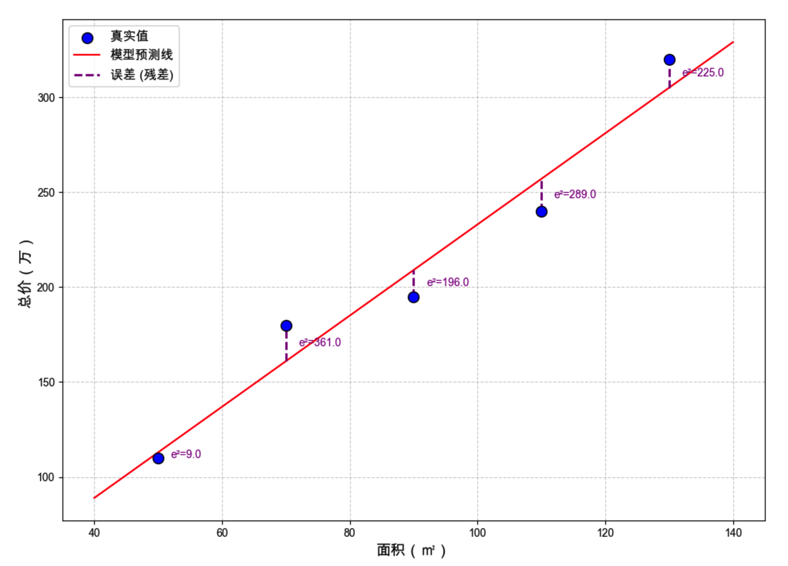
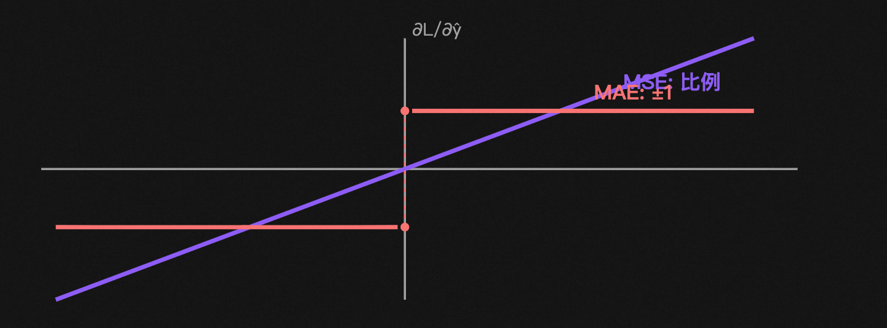
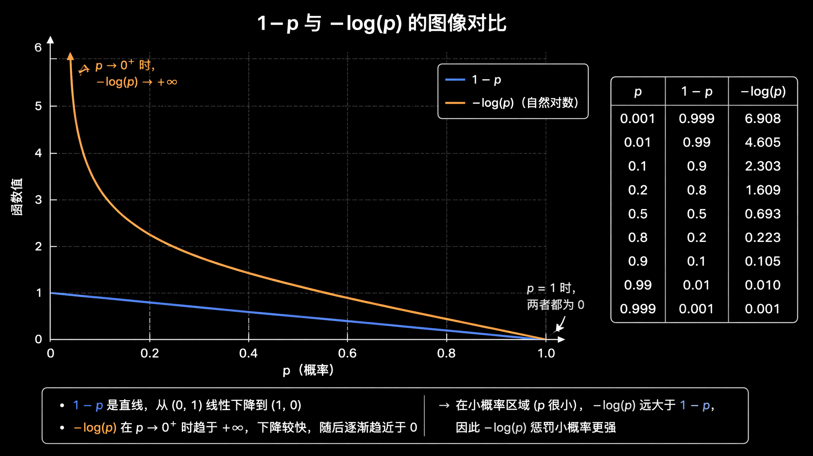

# 本节内容
1. 损失函数的作用
2. 损失函数的三个角色
3. 回归损失: MSE 解析
4. MSE 的优势与局限
5. MSE 为何不适用于分类
6. 分类损失的需求
7. 交叉熵及其由来
8. 交叉熵的实现与优势
9. 总结与工程实践

# 损失函数的作用

通过损失函数输出的数字反映模型的偏差程度，并以其梯度指导模型优化方向

在模型训练中的 3 种角色:  
1. **度量**  
	将预测值 $\hat{y}$ 和真实值 $y$ 的差距量化为标量 $L(\hat{y}, y)$ , 可适用于模型比较  
2. **梯度信号源**  
	反向传播自损失函数对预测值求偏导起步 $\partial L / \partial \hat{y}$   
	若选择的损失函数不同，则**反向传播的起点信号**不同  
3. **任务目标**  
	模型并非直接实现“分类任务”，而是通过“交叉熵最小化”实现前者  
	损失函数**将人类的任务意图翻译给优化器**的桥梁  

# 均方误差 MSE
均方误差 (Mean Squared Error, MSE), 也叫 **L2 Loss** ，
**是回归任务的默认损失函数**  

$$
L_{MSE} = \cfrac{1}{N} \sum^{N}_{i=1}(\hat{y_i} - y_i)^2
$$

## 计算步骤  
1. 计算误差  
	$\hat{y_i} - y_i$  
2. 计算平方  
	$(\hat{y_i} - y_i)^2$  
3. 计算均值  
	$\cfrac{1}{N} \sum \cdot$  

> [!TIP]  
> 有时使用 $L = \cfrac{1}{2} (\hat{y} - y)^2$  
> 加入前置系数能在求导后得到简洁形式 $\partial L / \partial \hat{y} = \hat{y} - y$ ，不影响优化的结果  

## 使用平方而非绝对值

### 优势
1. **消去正负**  
	避免直接求和时正负误差的相互抵消  

2. **缩放误差**  
	放大显著误差，缩小细微误差  

	

3. **梯度自适应性**  
	平方带来对梯度的自适应性  
	
	- **MSE (L2)**  
		$\cfrac{\partial L}{\partial \hat{y}} = 2(\hat{y} - y)$   
		MSE 损失函数的梯度是**过原点的直线**，梯度与误差正相关，自带“**自适应步长**”  
	- **MAE (L1)**  
		$\cfrac{\partial L}{\partial \hat{y}} = \text{sign}(\hat{y} - y)=\begin{cases}1, &\hat{y} - y >0\\0, &\hat{y} - y =0\\-1, &\hat{y} - y <0\\\end{cases}$   
		MAE 损失函数的梯度步长恒为1，且在 $\hat{y} = y$ 处不可导  

4. **隐含正态分布概率假设**  
**预测误差** $\epsilon = y - \hat{y}$ **服从正态分布(高斯分布)**  
大部分样本误差接近 0，越远离 0 的样本误差越少  
基于如此假设，**最小化 MSE 等价于最大似然估计**  
因此 MSE 适用的回归任务特征如下:  
	- 误差对称
	- 集中 0 处附近
	- 没有重尾

### 局限
1. 对离群点过分敏感  
	平方缩放误差导致对离群点过分敏感  
	假设有标签错误的样本，将真值 1e+2 错标为 1e+4，贡献为 $9900^2 \approx 10^8$   
	此时整个 batch 的梯度会严重偏离  
	标签噪声大时适用 Huber Loss (小误差用 MSE, 大误差用 MAE)  
2. 假设目标连续可比  
	MSE 默认 “差 2 比差 1 严重 4 倍”  
	适用于房价、温度等连续可比的数值  
	不适用于类别标签，将猫(1)作狗(2)或将猫(1)作飞机(4)，从分类正误看是一样错  
3. 配合 Sigmoid 会梯度消失  
	是 MSE **不适用于分类任务**的根本原因  

MSE + Sigmoid 的组合会出现梯度与误差负相关，误差越大梯度越小  

设 $\hat{y} = \sigma(z) \ , \ L=\cfrac{1}{2}(\hat{y} - y)^2$ , 反向传播到 $z$ , 使用 $\sigma'(z) = \hat{y}(1-\hat{y})$   

$$
\cfrac{\partial L}{\partial z} = \cfrac{\partial L}{\partial \hat{y}} \cdot \cfrac{\partial \hat{y}}{\partial z} = (\hat{y} - y) \cdot \underbrace{\hat{y}(1 - \hat{y})}_{\sigma'(z)}
$$

假设对正样本 $y=1$ 预测严重偏离 $\hat{y} \approx 0$   

$$
\cfrac{\partial L}{\partial z} = \underbrace{(\hat{y} - y)}_{= -1, 很大} \cdot \underbrace{\hat{y}(1-\hat{y})}_{\approx 0, 饱和} \approx 0
$$

对此显著误差应对参数作大幅更新，但 Sigmoid 在 0 端已“压平”  
$\hat{y}(1-\hat{y}) \to 0$ 对整个梯度乘成 0  
模型训练推至极端误差出现梯度消失，学习进程停滞  

# 分类任务损失函数
对于回归任务， MSE 满足目标“残差越小越好”  
对于分类任务，目标变为“模型对真实类别的预测概率 $p$ 大小”  

对损失函数的选择，应当满足如下性质  
1. 输入概率而非数值  
	损失关注概率 $p \in (0,1)$   
	模型对真实类别的概率打分，而非“相差几个标签类号”  
2. 对于 $p$ 单调递减  
	概率 $p$ 越大损失越小， $p=1$ 时损失为 0  
	概率越大奖励越强，方向和“预测正确”应完全一致  
3. 误差越大惩罚越大  
	$若概率 p \to 0 ，则损失 L \to +\infty$   
	如此给模型强烈的纠偏信号，而非对“显著误差”和“细微误差”无法区别的惩罚  
4. 多样本可加性  
	 $N$ 个独立样本的总损失最好的形式如 $\sum_{i} L_{i}$  
	便于求和、求平均值、反向传播  
	若为形如 $\prod_{i} p_{i}$ 连乘形式，则数值迅速下溢至 0



## 线性惩罚 1 - p

$$
L = 1 - p_{真}
$$

满足性质 1 , 2, 4  
**损失输出上限为 1**，无法区分对“显著误差”和“细微误差”的惩罚  
值域 (0, 1) 内的数值连乘将指数级趋于 0，数值几乎不可处理导致信息丢失  
**梯度为常数**，自适应能力差  

## 对数惩罚 -log p

$$
L = - \log{p_{真}}
$$

$若 p \to 0, 则\ L \to + \infty$ 满足性质 3  
$\log{A\times B} = \log{A} + \log{B}, \ \log{\prod_i p_i} = \sum_i \log {p_i}$ 满足性质 4  
信息论中称 $L = -\log{p_{真}}$ 为 **交叉熵 (Cross-Entropy)**  

> [!TIP]  
> 熵 (Entropy) 反映一个分布的不确定性: 确定事件所需的平均信息量  
> - 公平硬币 (50/50): 猜不透 熵大  
> - 作弊硬币 (99/01): 没悬念 熵小  

> [!TIP]
> 交叉熵 (Cross-Entropy) 反映两个分布的差异: 用分布 q 描述真实分布 p 的平均信息量  
> 在分类任务中，“两个分布”即为 **模型预测的概率分布** 和 **真实标签分布**  
> CE Loss 计算二者差距，差距越小模型越好

## 二分类交叉熵 (BCE)

$$
L_{BCE} = -[\underbrace{y\log{\hat{y}}}_{正样本项} + \underbrace{(1-y)\log{1-\hat{y}}}_{负样本项}]
$$

二分类标签有两种情况  
1. 正样本 $y=1$   
2. 负样本 $y=-1$   

$y, \, 1-y$ 形如开关，确定标签之后，一项乘 0 舍弃， 一项乘 1 保留  

|真实标签|公式坍缩|含义|
|:--------:|:----------:|:----------:|
|$y = 1$ (正样本)|$-\log \hat y$|$\hat y \to 1$ 损失 $\to 0$，$\hat y \to 0$ 损失 $\to +\infty$|
|$y = 0$ (负样本)|$-\log(1-\hat y)$|$\hat y \to 0$ 损失 $\to 0$，$\hat y \to 1$ 损失 $\to +\infty$|

对于多个样本，交叉熵损失公式推广为

$$
L_{BCE} = -\cfrac{1}{m} \sum^m_{i=1}[y_i \log{\hat{y}} + (1 - y_i) \log{1- \hat{y}}]
$$


以链式法则求导时， Sigmoid 的导数和交叉熵的导数约分抵消，形式如同 MSE 。  
区别在于 $\hat{y}$ 含义不同  

$$
\cfrac{\partial L_{BCE}}{\partial z} = \hat{y} - y
$$

[推导过程](https://github.com/NothingForID/Machine_Learning/blob/main/Note.md#%E6%A2%AF%E5%BA%A6%E4%B8%8B%E9%99%8D)参照机器学习笔记  

能够相互约并非偶然，交叉熵和 Sigmoid 在数学上经过专门设计，多分类交叉熵和 softmax 同理。

## 多分类交叉熵 softmax + CE
对三分类任务，模型输出 $z = [2.0, 1.0, 0.1]$ , 即第 0 类得分最高  

将其代入交叉熵的 $-\log{p}$ , 分为两步  
1. 化“原始打分”为 **合法概率分布**  
2. 计算交叉熵  

具体如下  
1. softmax: 化 logits 为概率  
	经过 softmax 处理，**确保每项非负，并且总和为 1**  
	得到合法概率分布:  
	$\hat{y_k} = \cfrac{e^{z_k}}{\sum_j e^{z_j}}$   
	代入案例:  
	$z = [2.0, 1.0, 0.1] \to \hat{y} = [0.66, 0.24, 0.10]$   
2. CE: 求和坍缩至正确类  
	假设真实类别是第 0 类, one-hot 标签 $y = [1, 0, 0]$   
	CE 对 $K$ 项求和  
	$L = - (\underbrace{1 \cdot \log{0.66}}_{正确类} + \underbrace{0 \cdot \log{0.24}}_{=0} + \underbrace{0 \cdot \log{0.10}}_{=0}) =  -\log{0.66} \approx 0.42$   
	$K$ 项中只保留“正确类”，如同 BCE “开关”机制  
	**多分类 CE 实质是** $-\log{\hat{y_{正确类}}}$   

反向传播到 logits 的梯度， softmax 导数和 CE 的 log 互相抵消， 形式如同 BCE :  

$$
\cfrac{\partial L_{CE}}{\partial z_k} = \hat{y_k} - y_k
$$

由于能够精准区分对分类预测错误的惩罚，同时具有线性、不饱和、便利计算的梯度形式， **交叉熵成为分类任务损失函数的首选**  

# 对比常用损失

|     |MSE|BCE|Softmax + CE|
|:------------|:--------|:----------|:----------|
|适用任务|回归，预测连续值|二分类|多分类|
|输出层 |无激活，线性 $\hat y$|Sigmoid → 1 个概率 $\hat y$|Softmax → $K$个概率|
|损失公式|$(\hat y - y)^2$|$-[y\log\hat y + (1-y)\log(1-\hat y)]$|$-\log \hat y_c$|
|梯度公式|$2(\hat y - y)$|$\hat y - y$|$\hat y_k - y_k$|
|概率假设|正态分布|伯努利分布|多项分布|
|PyTorch API|`nn.MSELoss`|`nn.BCEWithLogitsLoss`|`nn.CrossEntropyLoss`|

> [!TIP]  
> 1. 回归用 MSE  
> 2. 二分类用 BCE
> 3. 多分类用 Softmax+CE。

# PyTorch 实现

```python
import torch
import torch.nn as nn

# 1. 回归 MSE
criterion = nn.MSELoss()	# 默认 reduction = 'mean'
loss = criterion(pred, target)	# pred, target 为同形状浮点张量

# 2. 二分类 BCE
# 推荐使用 BCEWithLogitsLoss, 输入为 logits (Sigmoid 之前), 数值更加稳定
criterion = nn.BCEWithLogitsLoss()
loss =criterion(logits, target.float()) # target 是值域为 (0, 1) 的浮点型

# 3. 多分类 CrossEntropyLoss
# 关键: 输入为 logits (softmax 之前) 不是概率
criterion = nn.CrossEntropyLoss()
loss = criterion(logits, target.long()) # target 为 LongTensor 型，存类别下标 (并非 one-hot)
```

`nn.CrossEntropyLoss` 的输入为 logits，并非 softmax 之后的概率。  
其内部已混合对 log-softmax 和 NLL 的计算。  
若在网络最后补充 softmax，则相当于重复两次 softmax，导致损失几乎无法学习。  

```python
# 错误示例
model = nn.Sequential(
	nn.Linear(784, 256),
	nn.ReLU(),
	nn.Linear(256, 10),
	nn.Softmax(dim = -1), # 此处应当舍弃
)
criterion = nn.CrossEntropyLoss() # 内部包含一次 log_softmax

# 正确示例
model = nn.Sequential(
	nn.Linear(784, 256),
	nn.ReLU(),
	nn.Linear(256, 10), # 直接使用 logits
)
criterion = nn.CrossEntropyLoss()
```